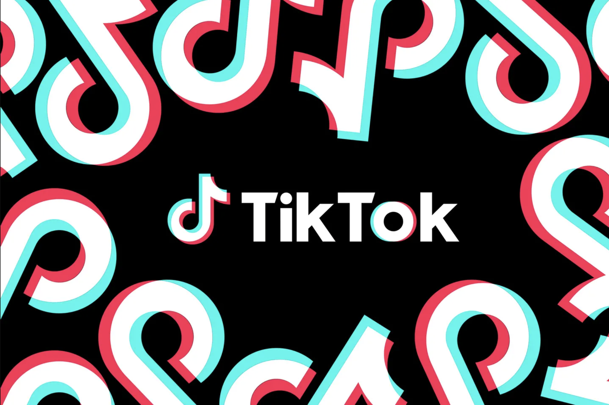

# TikTok Trend Analyzer

<!-- Improved compatibility of back to top link: See: https://github.com/othneildrew/Best-README-Template/pull/73 -->

<!--
*** Thanks for checking out the Best-README-Template. If you have a suggestion
*** that would make this better, please fork the repo and create a pull request
*** or simply open an issue with the tag "enhancement".
*** Don't forget to give the project a star!
*** Thanks again! Now go create something AMAZING! :D
-->

<!-- PROJECT SHIELDS -->
<!--
*** I'm using markdown "reference style" links for readability.
*** Reference links are enclosed in brackets [ ] instead of parentheses ( ).
*** See the bottom of this document for the declaration of the reference variables
*** for contributors-url, forks-url, etc. This is an optional, concise syntax you may use.
*** https://www.markdownguide.org/basic-syntax/#reference-style-links
-->

<!-- PROJECT LOGO -->
 

  

     
    <a href="https://github.com/p-sandher/Instagram_Trend_Analyzer"><strong>Explore the Repo »</strong></a>
     
     
  

<!-- ABOUT THE PROJECT -->
## About The Project

TikTok Trend Analyzer is an undergraduate capstone project  for CIS*4900 at the University of Guelph, set to be completed by August 10, 2024. This project invovles the development of a machine learning model to identify and predict TikTok trends. After the model has been trained, a user-friendly web application will allow users to search and filter trends by time and category. This project is developed by Sulakshan Sivakumaran and Puneet Sandher, both who have limited experience with machine learning and this project is considered a learning experience. 

This repository includes the entire development process including data preprocessing, model training, model finetuning, evaluating models and created graphs, and the final report. 

### Project Milestones: Weekly Breakdown

Week 1 (May 1 - May 6): Developing foundational ML and AI knowledge ✅

Week 2 (May 7 - May 11): Architecture design ✅

Week 3 (May 12 - May 18): Find relevant datasets and develop scripts to webscrape data ✅

Week 4 (May 19 to May 26) : Research data preprocessing techniques ✅

Week 5 (May 27 to June 5): Preprocess data ✅

Week 6 (June 6 to June 13): Prepare report and deliverables for submission ✅

Week 7 (June 14 to June 21): Explore and learn machine learning algorithms and tools ✅

Week 8 & Week 9 (June 22 to July 6): Train models ✅

Week 10 & Week 11 (July 7 to July 21): Finetune and evaluate models ✅

Week 12 & Week 14 (July 22 to August 6): Prepare final report and deliverables ✅

### Built With

* [![Tailwind][Tailwind]][Tailwind-url]
* [![Html][Html]][Html-url]
* [![Js][Js]][Js-url]
* [![Python][Python]][Python-url]
* [![Pytorch][Pytorch]][Pytorch-url]
* [![Reactjs][Reactjs]][Reactjs-url]
* [![Tensorflow][Tensorflow]][Tensorflow-url]
* [![SQLite][SQLite]][SQLite-url]
* [![Docker][Docker]][Docker-url]
* [![AWS][AWS]][AWS-url]

(<a href="#readme-top">back to top</a>)

<!-- CONTACT -->
## Contact

[![LinkedIn][linkedin-shield]][linkedin-url]
 
Puneet Sandher -  puneetsandher@gmail.com

Project Link: [https://github.com/p-sandher/Instagram_Trend_Analyzer](https://github.com/p-sandher/Instagram_Trend_Analyzer)

Website Link: [https://puneet-sandher.netlify.app/](https://puneet-sandher.netlify.app/)

Sulakshan Sivakumaran - sulakshansivak@gmail.com

Project Link: [https://github.com/SulakshanSiva/Instagram_Trend_Analyzer](https://github.com/SulakshanSiva/Instagram_Trend_Analyzer)

Website Link: [https://sulakshansiva.github.io/Sulakshan/](https://sulakshansiva.github.io/Sulakshan/)

(<a href="#readme-top">back to top</a>)

<!-- ACKNOWLEDGMENTS -->
## Acknowledgments

ReadME template is from 
* [othneildrew](https://github.com/othneildrew/Best-README-Template)

(<a href="#readme-top">back to top</a>)

<!-- MARKDOWN LINKS & IMAGES -->
<!-- https://www.markdownguide.org/basic-syntax/#reference-style-links -->

[linkedin-shield]: https://img.shields.io/badge/-LinkedIn-black.svg?style=for-the-badge&logo=linkedin&colorB=555
[linkedin-url]: https://www.linkedin.com/in/puneet-sandher/

[Html]: https://img.shields.io/badge/HTML5-E34F26?style=for-the-badge&logo=html5&logoColor=white
[Html-url]: https://html.com/
[Tailwind]: https://img.shields.io/badge/tailwindcss-%2338B2AC.svg?style=for-the-badge&logo=tailwind-css&logoColor=white
[Tailwind-url]: https://tailwindcss.com/
[Js]: https://img.shields.io/badge/JavaScript-323330?style=for-the-badge&logo=javascript&logoColor=F7DF1E
[Js-url]: https://developer.mozilla.org/en-US/docs/Web/JavaScript
[Python]: https://img.shields.io/badge/Python-FFD43B?style=for-the-badge&logo=python&logoColor=blue
[Python-url]: https://www.python.org/
[Pytorch]: https://img.shields.io/badge/PyTorch-%23EE4C2C.svg?style=for-the-badge&logo=PyTorch&logoColor=white
[Pytorch-url]: https://pytorch.org/docs/stable/index.html
[Reactjs]: https://img.shields.io/badge/react-%2320232a.svg?style=for-the-badge&logo=react&logoColor=%2361DAFB
[Reactjs-url]: https://react.dev/
[Tensorflow]: https://img.shields.io/badge/TensorFlow-%23FF6F00.svg?style=for-the-badge&logo=TensorFlow&logoColor=white
[Tensorflow-url]: https://www.tensorflow.org/
[SQLite]: https://img.shields.io/badge/sqlite-%2307405e.svg?style=for-the-badge&logo=sqlite&logoColor=white
[SQLite-url]: https://www.sqlite.org/docs.html
[Docker]: https://img.shields.io/badge/docker-%230db7ed.svg?style=for-the-badge&logo=docker&logoColor=white
[Docker-url]: https://docs.docker.com/
[AWS]: https://img.shields.io/badge/AWS-%23FF9900.svg?style=for-the-badge&logo=amazon-aws&logoColor=white
[AWS-url]: https://docs.aws.amazon.com/

